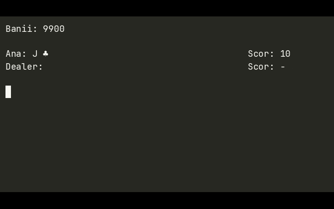

# Blackjack — Console Card Game (C++)

[](https://github.com/BogdanNVal/Blackjack/actions/workflows/ci.yml)
[](LICENSE)

A console-based Blackjack game written in C++, with custom classes for each
game concept (card, deck, linked list for a hand, player) and simple player
persistence between sessions.

The game logic lives in a small, unit-tested core library that is completely
free of console I/O, so it can be tested and reused (for example by the
built-in basic-strategy advisor). It builds and runs cross-platform (Linux,
macOS, Windows) via CMake, and still opens as a Visual Studio 2022 solution
on Windows.

## Gameplay



> Recorded on Linux (monochrome); on Windows the cards and result messages
> are shown in color, as in the screenshots below.

## Screenshots


## Features

- **Main menu**: new player or continue with an already saved player.
- **Standard Blackjack rules**: Hit, Stand, Double (double the bet + exactly
  one additional card, offered only on the first two cards); aces count as 1
  or 11, calculated automatically for the optimal score; the dealer
  automatically draws while their score is below 17.
- **Natural blackjack pays 3:2**: a 21 made from the first two cards is a
  "natural" and pays 3:2, settled immediately. If the dealer also has a
  natural it is a push; if only the dealer has one, the hand is lost right
  away. A 21 reached from three or more cards is a normal 21, not a natural.
- **Correct outcome determination**: bust, natural blackjack, score
  higher/equal/lower than the dealer's.
- **Continue playing**: after each round you can keep playing with the same
  player, keeping your accumulated money, without restarting the application.
- **Save/load player**: the name and money are saved automatically on exit
  to a text file (`jucatori.txt`), and can be reloaded in the next session.
- **Score displayed right-aligned on screen**, for each hand; while the
  dealer still has a hidden card, their score is shown as "value+?".
- **Card-dealing "animation"**: cards appear one at a time, with a short
  pause between them, instead of all appearing at once.
- **Console colors**: Hearts/Diamonds cards are shown in red, and result
  messages are colored (green for a win, red for a loss/bust, yellow for a
  tie).
- **Graphical card symbols**: Clubs/Hearts/Spades/Diamonds are displayed as
  Unicode symbols (♣ ♥ ♠ ♦), not as letters (C/H/S/D).
- **Basic-strategy advisor**: before each decision the game prints the
  action recommended by Blackjack basic strategy (Hit / Stand / Double),
  computed from your total, whether the hand is soft, and the dealer's
  upcard.
- **Unit-tested core + CI**: the game rules (scoring, ace logic, deck,
  outcome, strategy) are covered by a Catch2 test suite, run on every push
  via GitHub Actions on Linux and Windows.

## Tech stack

- C++17, standard library only for the game itself
  (`<iostream>`, `<fstream>`, `<random>`, `<thread>`, `<chrono>`, `<map>`)
- CMake build (cross-platform) producing a `blackjack_core` static library,
  the `blackjack` executable, and a `blackjack_tests` test binary
- [Catch2 v3](https://github.com/catchorg/Catch2) for unit tests (fetched
  automatically by CMake; only needed when building tests)
- GitHub Actions CI (Ubuntu + Windows): configure, build, run `ctest`
- Also opens as a Visual Studio 2022 project (`.sln` / `.vcxproj`) on Windows
- Custom classes for each concept: `Carte` (Card), `Lista` (List — a hand-
  written linked list used for each player's hand), `Pachet` (Deck),
  `Jucator` (Player)
- Deck shuffling: `std::mt19937` + `std::random_device`
- Player persistence: plain text file, read/written with `std::fstream` and
  `std::map` for lookup by name
- Pauses between cards: `std::this_thread::sleep_for`
- Console colors: Windows Console API (`SetConsoleTextAttribute`)

## Building and running (CMake, any platform)

```bash
cmake -S . -B build -DCMAKE_BUILD_TYPE=Release
cmake --build build --parallel
./build/blackjack           # blackjack.exe on Windows
```

Run the unit tests:

```bash
ctest --test-dir build --output-on-failure
```

To build only the game (skip fetching Catch2), pass
`-DBLACKJACK_BUILD_TESTS=OFF` at configure time.

> Note: on some Linux setups the default `c++` compiler is Clang without a
> working `libstdc++` link. If configuration fails to compile a test program,
> add `-DCMAKE_CXX_COMPILER=g++`.

## Running on Windows (Visual Studio)

1. Open `Blackjack.sln` in Visual Studio 2022.
2. If a build error related to the **v143** toolset appears, install the
   missing component from the Visual Studio Installer:
   Modify → Individual components → **MSVC v143 - VS 2022 C++ x64/x86
   build tools**.
3. Build & Run (F5). The game starts directly in the console.

The save file `jucatori.txt` is created automatically, next to the
executable, the first time a player is saved — it doesn't need to be
created manually.

## Architecture

The code is split so that the game rules never depend on console I/O:

- `blackjack_core` (library, no I/O): `Carte`, `Lista`, `Pachet`, `Jucator`,
  `Reguli` (scoring / outcome / dealer rule), `Strategie` (basic-strategy
  advisor), `Salvare` (persistence). This layer is what the unit tests link
  against.
- Console layer: `Joc` (rendering, menus, the game loop) and `Source`
  (`main`). Screen clearing and "press Enter" pauses are portable helpers
  (ANSI escapes on POSIX, the Windows console on `_WIN32`) instead of
  `system("cls")` / `system("pause")`.

There is no global mutable state: the deck (`Pachet`) and the dealer
(`Jucator`) are owned by the game loop and passed explicitly to the round
functions.

## Technical decisions worth noting

- The `Jucator` class correctly implements the Rule of Three (copy
  constructor + `operator=`), because it dynamically allocates memory for
  the name (`new char[]`) and contains a `Lista` object with its own
  allocation — copying a `Jucator` (for example, when loading a saved
  player) is safe, with no double-free.
- Deck shuffling uses an `std::mt19937` generator seeded once from
  `std::random_device`, not `rand()`/`srand(time(0))` — a time-based seed
  with 1-second resolution would produce the same shuffle if the game were
  started multiple times within the same second.
- Player persistence is an unencrypted text file, sufficient for a project
  of this kind, but not suitable for sensitive data in a real-world
  context.
- **Split is not implemented**: it would require `Jucator` to be able to
  hold multiple hands at once (instead of a single `Lista carti` + a single
  `suma_pariata`), plus adapting the game loop in `Joc.cpp` to iterate over
  the active hands — a targeted restructuring, not just filling in an
  empty function.
- **Card symbols (♣ ♥ ♠ ♦) are Unicode, written as raw UTF-8 bytes**
  directly in the code (`\xE2\x99\xA3` etc.), not as OEM codepage letters —
  they display correctly in any console (classic cmd, Windows Terminal),
  regardless of the font used. The console's output codepage is explicitly
  set to UTF-8 (`SetConsoleOutputCP(CP_UTF8)`) in `Source.cpp`. Because a
  UTF-8 symbol takes up 3 bytes but displays as a single character, the
  column alignment of hands in `Joc.cpp` counts Unicode characters, not raw
  bytes (the `lungimeUtf8` function), otherwise the padding would come out
  wrong.

## Project structure

```
Blackjack/
  CMakeLists.txt                -> cross-platform build (core lib + game + tests)
  Blackjack.sln                 -> Visual Studio solution
  .github/workflows/ci.yml      -> CI: build + ctest on Linux and Windows
  Blackjack/
    Source.cpp                  -> main() -> meniuPrincipal()
    Joc.h / Joc.cpp              -> menu, game loop, rendering (console layer)
    Jucator.h / Jucator.cpp      -> Jucator class (money, hand, score)
    Carte.h / Carte.cpp          -> Carte class (value + symbol)
    Lista.h / Lista.cpp          -> linked list, used for the hand
    Pachet.h / Pachet.cpp        -> the 52-card deck + shuffling (a class)
    Reguli.h / Reguli.cpp        -> pure rules: scoring, ace logic, outcome
    Strategie.h / Strategie.cpp  -> basic-strategy advisor
    Salvare.h / Salvare.cpp      -> player save/load (jucatori.txt)
    Blackjack.vcxproj(.filters) -> Visual Studio project configuration
  tests/
    test_scor.cpp                -> scoring / ace logic
    test_pachet.cpp              -> deck (52 unique cards, draw, empty)
    test_reguli.cpp              -> outcomes + dealer-draw rule
    test_strategie.cpp           -> basic-strategy cells
```

The `Lista` linked list and `Jucator`'s manual Rule-of-Three (below) are kept
deliberately as data-structure and memory-management exercises rather than
being replaced with `std::vector` / `std::string`.

## License

Released under the [MIT License](LICENSE).
