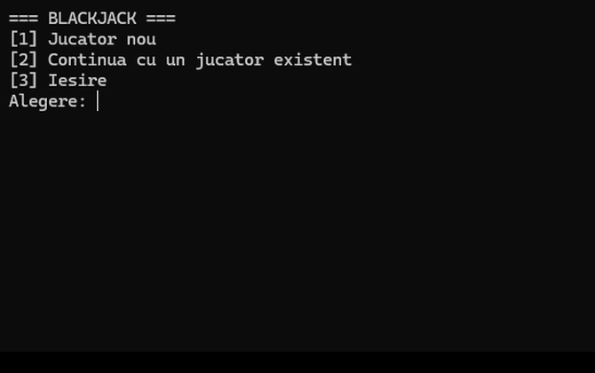
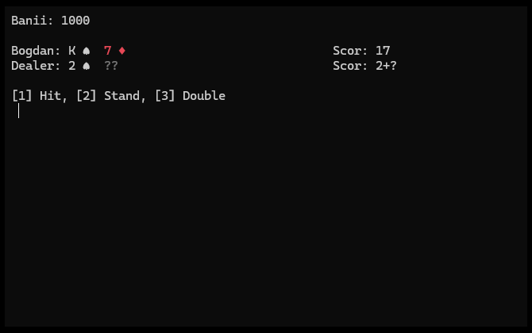
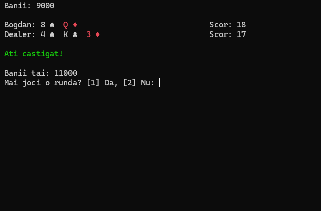

# Blackjack — Joc de carti pentru consola (C++)

Joc de Blackjack pentru consola, scris in C++, cu clase proprii pentru fiecare
concept al jocului (carte, pachet, lista inlantuita pentru o mana, jucator) si
persistenta simpla a jucatorilor intre sesiuni.

## Screenshot-uri





## Functionalitati

- **Meniu principal**: jucator nou sau continuare cu un jucator deja salvat.
- **Reguli standard de Blackjack**: Hit, Stand, Double (dublare pariu + o
  singura carte suplimentara); asii valoreaza 1 sau 11, calculat automat
  pentru scorul optim; dealerul trage automat cat timp scorul ii e sub 17.
- **Determinare corecta a rezultatului**: bust, blackjack natural (push),
  scor mai mare/egal/mai mic decat al dealerului.
- **Reluare runda**: dupa fiecare runda poti continua cu acelasi jucator,
  pastrandu-ti banii acumulati, fara sa repornesti aplicatia.
- **Salvare/incarcare jucator**: numele si banii se salveaza automat la
  iesire intr-un fisier text (`jucatori.txt`), si pot fi reincarcate la
  urmatoarea sesiune.
- **Scor afisat aliniat in dreapta ecranului**, pentru fiecare mana; cat timp
  dealerul mai are o carte ascunsa, scorul lui e afisat ca "valoare+?".
- **"Animatie" de impartire a cartilor**: cartile apar pe rand, cu o scurta
  pauza intre ele, in loc sa apara toate deodata.
- **Culori in consola**: cartile de Inima/Diamant apar cu rosu, mesajele de
  rezultat sunt colorate (verde la castig, rosu la pierdere/bust, galben la
  egalitate).
- **Simboluri grafice pentru carti**: Trefla/Inima/Pica/Romb se afiseaza ca
  simboluri Unicode (♣ ♥ ♠ ♦), nu ca litere (C/H/S/D).

## Stack tehnic

- C++17, fara dependinte externe — doar biblioteca standard
  (`<iostream>`, `<fstream>`, `<random>`, `<thread>`, `<chrono>`, `<map>`)
- Proiect Visual Studio 2022 (`.sln` / `.vcxproj`), platformă x64/Win32
- Clase proprii pentru fiecare concept: `Carte`, `Lista` (lista inlantuita
  scrisa manual, folosita pentru mana fiecarui jucator), `Pachet`, `Jucator`
- Amestecarea pachetului: `std::mt19937` + `std::random_device`
- Persistenta jucatorilor: fisier text simplu, citit/scris cu `std::fstream`
  si `std::map` pentru cautare dupa nume
- Pauzele dintre carti: `std::this_thread::sleep_for`
- Culori in consola: Windows Console API (`SetConsoleTextAttribute`)

## Rulare locala

1. Deschide `Blackjack.sln` in Visual Studio 2022.
2. Daca la build apare o eroare legata de toolset-ul **v143**, instaleaza
   componenta lipsa din Visual Studio Installer:
   Modify → Individual components → **MSVC v143 - VS 2022 C++ x64/x86
   build tools**.
3. Build & Run (F5). Jocul porneste direct in consola.

Fisierul de salvare `jucatori.txt` se creeaza automat, langa executabil, la
prima salvare a unui jucator — nu trebuie creat manual.

## Decizii tehnice de retinut

- Clasa `Jucator` implementeaza corect Rule of Three (constructor de copiere
  + `operator=`), pentru ca aloca memorie dinamic pentru nume (`new char[]`)
  si contine un obiect `Lista` cu propria alocare — copierea unui `Jucator`
  (de exemplu la incarcarea unui jucator salvat) e sigura, fara double-free.
- Amestecarea pachetului foloseste un generator `std::mt19937` seed-uit o
  singura data din `std::random_device`, nu `rand()`/`srand(time(0))` — un
  seed bazat pe timp cu rezolutie de 1 secunda ar produce acelasi amestec
  daca jocul e pornit de mai multe ori in aceeasi secunda.
- Persistenta jucatorilor e un fisier text necriptat, suficient pentru un
  proiect de acest tip, dar nepotrivit pentru date sensibile intr-un
  context real.
- **Split nu e implementat**: ar necesita ca `Jucator` sa poata detine mai
  multe maini simultan (in loc de o singura `Lista carti` + un singur
  `suma_pariata`), plus adaptarea buclei de joc din `Joc.cpp` sa itereze
  peste mainile active — o restructurare punctuala, nu doar completarea
  unei functii goale.
- **Simbolurile cartilor (♣ ♥ ♠ ♦) sunt Unicode, scrise ca octeti UTF-8**
  direct in cod (`\xE2\x99\xA3` etc.), nu ca litere din codepagina OEM —
  merg corect in orice consola (cmd clasic, Windows Terminal), indiferent
  de fontul folosit. Codepagina de iesire a consolei e setata explicit pe
  UTF-8 (`SetConsoleOutputCP(CP_UTF8)`) in `Source.cpp`. Deoarece un simbol
  UTF-8 ocupa 3 octeti dar un singur caracter afisat, alinierea pe coloane
  a mainilor din `Joc.cpp` numara caractere Unicode, nu octeti brut
  (functia `lungimeUtf8`), altfel padding-ul ar fi iesit gresit.

## Structura proiectului

```
Blackjack/
  Blackjack.sln                 -> solutia Visual Studio
  Blackjack/
    Source.cpp                  -> main() -> meniuPrincipal()
    Joc.h / Joc.cpp              -> meniu, bucla de joc, regulile unei runde
    Jucator.h / Jucator.cpp      -> clasa Jucator (bani, mana, scor, actiuni)
    Carte.h / Carte.cpp          -> clasa Carte (valoare + simbol)
    Lista.h / Lista.cpp          -> lista inlantuita, folosita pentru mana
    Pachet.h / Pachet.cpp        -> pachetul de 52 de carti + amestecare
    Salvare.h / Salvare.cpp      -> salvare/incarcare jucatori (jucatori.txt)
    Blackjack.vcxproj(.filters) -> configurarea proiectului Visual Studio
```